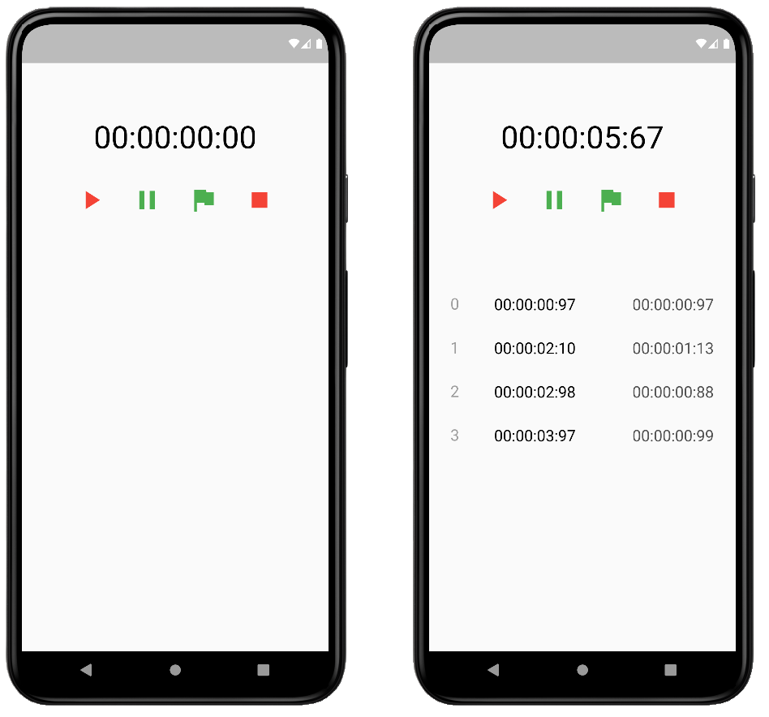

## Cronómetro
[](https://github.com/alanxpo/practicas-flutter/tree/main/cronometro)

## Descripción del proyecto
Este es un proyecto simple de un cronómetro hecho en Flutter. El objetivo de este proyecto es demostrar cómo se puede implementar un cronómetro en Flutter utilizando StatefulWidget. Es un proyecto simple pero útil que puede ser utilizado como punto de partida para proyectos más grandes.

## Estado del proyecto
El proyecto se encuentra en un estado activo y está abierto a contribuciones y mejoras.

## Características de la aplicación y demostración
El cronómetro se inicia al presionar el botón "Start". El tiempo transcurrido se muestra en la pantalla y se actualiza de forma automatica. El usuario puede detener el cronómetro en cualquier momento presionando el botón "Stop". Además, el usuario puede reiniciar el cronómetro en cualquier momento presionando el botón "Reset". 
A continuación se muestra una captura de pantalla de la aplicación en funcionamiento:



## Tecnologías utilizadas
Este proyecto fue desarrollado utilizando el framework Flutter.

## Acceso al proyecto
1.Clonar este repositorio en tu máquina local utilizando la terminal o el símbolo del sistema utilizando el siguiente comando:
```
git clone https://github.com/alanxpo/practicas-flutter.git
```
2.Navegar al directorio del proyecto:
```
cd practicas-flutter/cronometro
```
3.Navegar al directorio del proyecto:
```
flutter run
```
